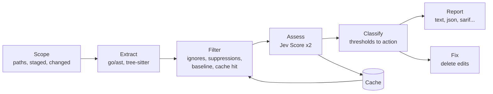
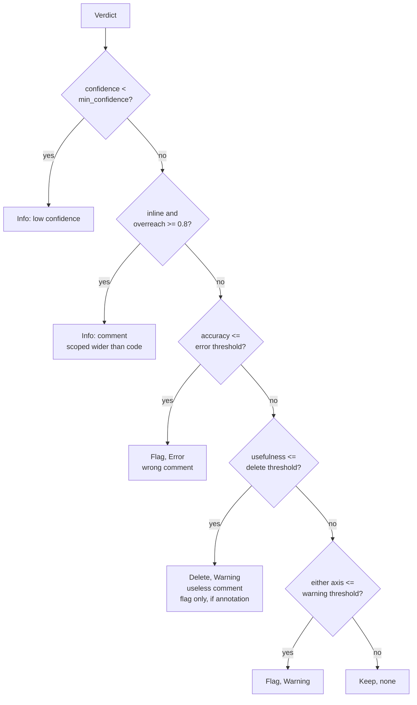

# scrutus v0.1 — Design Document

2026-09-17 · Sergey Aksёnov

## 1. Overview

scrutus is a Go CLI that finds inaccurate and useless source-code comments, reports them like a linter, and optionally deletes the useless ones. v0.1 uses a single scoring backend, Jev (TypeSafe AI), and targets three run contexts: local lint, pre-commit hook, and CI job.

**Goals (v0.1)**

- Grade every comment in scope on two axes, Accuracy and Usefulness, each 0–100 with a fixed-vocabulary label.
- Run as a linter (`check`), a pre-commit hook (`fix --staged`), and a CI job (`check --changed --format sarif`) from one binary with one config.
- Cost well under $0.01 per typical commit and under $5 for a 100k-comment repo, using Jev's Score primitive at $0.042 per million input tokens with free output.
- Deterministic results for unchanged input: content-addressed cache keyed on comment, code, rubric version and model version.
- Never turn an API outage into a lint failure.

**Non-goals (v0.1)**

- Rewriting comments. Jev does not generate text; v0.1 only reports and deletes. Rewrite is a v0.2 item behind a separate generator.
- Any backend other than Jev (no Claude/OpenAI, no local models).
- Grading TODO/FIXME/license headers/directive comments (`//go:generate`, `//nolint`, `// eslint-disable`). These are exempt by default: `exempt_prefixes` is matched against the comment text with its markers stripped, so `#!`, `/*!` and `//# sourceMappingURL` reduce to `!` and `sourceMappingURL`.
- Languages beyond the initial extractor set (Go, TypeScript/JavaScript, PHP, Python).
- An editor/LSP integration.

## 2. Architecture

One linear pipeline; every stage is an interface so the ends can be swapped without touching the middle.



Scope decides which files, Extract turns them into comment+code pairs, Filter drops what should not be scored, Assess calls Jev, Classify turns scores into actions, and Report or Fix consumes the result.

**Core types**

```go
type Finding struct {
    ID        string      // sha256(commentText, codeText, rubricVer, modelVer)
    File      string
    Comment   Span        // byte offsets, [Start, End)
    Code      Span        // the paired paragraph or declaration
    Kind      CommentKind // Doc, Inline, Trailing, Annotation
    CommentText, CodeText, Context string
}

type Verdict struct {
    FindingID  string
    Accuracy   Axis   // Score float64, Pct int, Label string, Confidence float64
    Usefulness Axis
    Overreach  Noul   // Prob float64: comment describes code outside the paired span
    Usage      Usage  // InputTokens, CostUSD
}

type Result struct {
    Finding  Finding
    Verdict  Verdict
    Action   Action   // Keep, Delete, Flag
    Severity Severity // Info, Warning, Error
}
```

**Interfaces**

```go
type Extractor interface {
    Languages() []string
    Extract(file string, src []byte) ([]Finding, error)
}

type Assessor interface {
    Assess(ctx context.Context, fs []Finding) ([]Verdict, error)
}

type Reporter interface {
    Report(w io.Writer, rs []Result, run RunInfo) error
}

type Cache interface {
    Get(id string) (Verdict, bool)
    Put(id string, v Verdict) error
}
```

The only stage that touches the network is `Assessor`. Everything before it is pure parsing; everything after it is pure policy. That split is what makes the tool testable without an API key and keeps the model's influence limited to two numbers per comment.

## 3. CLI surface

Two verbs plus housekeeping, built on cobra. `check` never writes; `fix` writes only deletions.

| Command | Purpose | Typical use |
| --- | --- | --- |
| `scrutus check [paths]` | Score and report; exit non-zero on findings | Local lint, CI |
| `scrutus fix [paths]` | Score, delete useless comments, report the rest | Pre-commit, local cleanup |
| `scrutus baseline [paths]` | Write current findings to `baseline.json` so they stop failing | Adopting on a legacy repo |
| `scrutus cache {clear,stats}` | Manage the local verdict cache | Debugging |
| `scrutus version` | Print version, the commit or module version it was built from, rubric version, Jev model id, compiled language set | Bug reports |

**Shared flags**

| Flag | Default | Meaning |
| --- | --- | --- |
| `--config PATH` | `.scrutus.toml` | Config file; searched upward from cwd |
| `--no-dotenv` | off | Skip `.env` loading; take the environment as given |
| `--staged` | off | Scope = files staged in git; hunks limited to staged lines |
| `--changed` | off | Scope = files differing from `--base` |
| `--base REF` | auto-detected (§4.1) | Base ref for `--changed` |
| `--baseline PATH` | `baseline.json` if present | Suppress findings present in the baseline |
| `--format F` | `text` (TTY) / `json` (pipe) | `text`, `json`, `sarif`, `github`, `rdjson`, `checkstyle` |
| `--fail-on LEVEL` | `error` | `error`, `warning`, `info`, `never` |
| `--profile NAME` | `default` | `strict`, `default`, `lenient` threshold presets (§6) |
| `--min-confidence X` | `0.5` | Verdicts below this are downgraded to `info` |
| `--budget CENTS` | `50` | Hard stop on estimated Jev spend for this run |
| `--concurrency N` | `8` | Parallel Jev requests |
| `--no-cache` | off | Bypass cache reads (writes still happen) |
| `--soft-fail` | off | Exit 0 on tool/network errors instead of 2 |
| `-o, --output PATH` | stdout | Write report to a file |
| `--stdin-filename PATH` | — | Name that picks the extractor when a path is `-` |

**`fix`-only flags**

| Flag | Default | Meaning |
| --- | --- | --- |
| `--diff` | off | Print a unified diff instead of writing files |
| `--dry-run` | off | Same as `--diff` but summary only |
| `--delete-threshold N` | from config | Override the Usefulness cutoff for deletion |
| `--allow-ci-write` | off | Permit writing files when CI is detected (§8) |

Stdin is accepted with `-` as the path and `--stdin-filename` to pick the extractor, which is what editor integrations will need later.

**Examples**

```
scrutus check ./...
scrutus check --changed --format sarif -o results.sarif
scrutus fix --staged --diff
git diff --name-only | xargs scrutus check
```

## 4. Input

### 4.1 Scope selection

Scope is resolved once, before extraction, into a list of `(file, allowedLineRanges)`.

- Explicit paths and globs; directories recurse; `./...` is accepted for Go familiarity.
- `--staged`: files from `git diff --cached --name-only`, ranges from `git diff --cached -U0`. Only comments whose span intersects a staged hunk are scored, so an unrelated old comment in the same file does not block a commit.
- `--changed --base REF`: same, against `git diff REF...HEAD`. Without `--base` the ref is resolved in order: `git symbolic-ref refs/remotes/origin/HEAD`, the current branch's upstream, `init.defaultBranch`, then whichever of `main` or `master` exists. The resolved ref is echoed in `text` output and recorded as `run.base` in JSON, because a wrong base silently yields an empty run rather than an error.
- Deleted and binary files are skipped; renamed files are scored fully.
- `.gitignore` is respected via `go-gitignore`; `ignore` globs in config are applied after.

### 4.2 Config file

`.scrutus.toml`, found by walking up from cwd; a repo root marker (`.git`) stops the search. Flags override config. An unknown key is an error, so a typo fails loudly instead of leaving a default in place. Durations are strings passed to `time.ParseDuration`, extended with `d` for days.

```toml
version = 1
rubric = "default"            # or a path to a rubric file (see §5)
profile = "default"           # strict | default | lenient (see §6)
languages = ["go", "typescript", "javascript", "php", "python"]
ignore = ["vendor/**", "**/*_test.go", "**/generated/**"]

[jev]
model = "jev-latest"          # pinned in CI, e.g. jev-1.13.0
timeout = "10s"
# api_key_env = "OTHER_VAR"    # optional; see §4.6

[thresholds]                  # any value here overrides the profile
min_confidence = 0.5
accuracy = { error = 30, warning = 60 }      # pct <= 30 -> error (wrong comment)
usefulness = { delete = 15, warning = 35 }   # pct <= 15 -> Delete (fix) / warning (check)

[comments]
kinds = ["doc", "inline", "trailing", "annotation"]
exempt_prefixes = [
  "TODO", "FIXME", "HACK", "XXX", "scrutus:",
  # license headers and banners, shebangs, editor and encoding lines
  "Copyright", "SPDX-License-Identifier", "@license", "@preserve", "!",
  "-*-", "vim:", "coding:", "coding=",
  "nolint", "go:",
  "phpcs:", "@phpstan-", "@psalm-",
  "eslint-", "@ts-", "prettier-ignore", "biome-ignore", "oxlint-", "tslint:",
  "jshint", "deno-", "istanbul ", "c8 ", "webpack", "sourceMappingURL",
  "sourceURL", "@jsx", "@flow", "@jest-", "@vitest-",
  "type: ignore", "noqa", "pragma:", "pylint:", "mypy:", "ruff:",
  "pyright:", "pyre-", "fmt:", "isort:", "yapf:", "nosec",
]
min_chars = 12                # shorter comments are skipped; annotations exempt
context_lines = 20            # enclosing-function context cap
keep_exported_docs = true     # Go: exported symbols keep their doc comment; PHP: docblocks on declarations
keep_docstrings = true        # Python: docstrings are never deleted
delete_annotations = false    # redundant annotations are flagged, not deleted

[cache]
dir = "~/.cache/scrutus"
ttl = "90d"
shared = false                # allow a store shared between users (see §9)
```

### 4.3 Extraction

Each `Extractor` yields a `Finding` per comment paired with the code it annotates.

| Language | Parser | Pairing rule |
| --- | --- | --- |
| Go | `go/ast` + `go/token` (`ast.CommentMap`) | Doc comment → the whole declaration (signature + body); inline → the paragraph that follows (see rules below); trailing → the statement on the same line |
| TypeScript, JavaScript | `go-tree-sitter` | Leading comment on a declaration → the whole declaration; other leading comments → the paragraph that follows; trailing → the node on the same line. A declaration is a function, class, method, field, interface, type alias, enum, signature or namespace anywhere, or a variable outside function bodies; inside one, a comment above `const` heads a paragraph. A member's decorators belong to it. Paragraphs run over statements, class and interface members, and object, array, argument and parameter entries. `/// <reference>` directives are syntax and never extracted |
| PHP | `VKCOM/php-parser` (pure Go) | A `/** */` docblock pairs with the following declaration, or with the statement below it when it sits in a body, which is where `/** @var Foo $bar */` lives; `#` line comments handled like `//` |
| Python | `go-tree-sitter` | `#` comments follow the paragraph and trailing rules; a comment right under a `def` or `class` header heads its body. A docstring — the first statement of a module, class or function — pairs with the whole declaration, decorators included, as `Kind: Doc`: its span is the quoted statement, so `fix` deletes it whole, while its `CodeText` is the declaration without it and it carries no `Context`. An f-string or bytes literal in that position is not a docstring |

Rules shared across extractors:

- **Paragraph rule (inline comments).** `CodeText` is the run of statements from the comment to the first of: a blank line, the next comment, or the end of the enclosing block. This matches how comments are written: a comment heads a visual chunk, not one line. Capped at 40 lines; longer paragraphs are truncated with a marker.
- **Declaration rule (doc comments).** `CodeText` is the full declaration, signature and body, capped at 40 lines so the model sees the signature and the opening logic.
- Spans are byte offsets, never line/column, so `fix` edits stay exact after earlier edits shift the file.
- Consecutive `//` or `#` lines merge into one comment. The PHP and tree-sitter extractors merge only comments alone on their lines and at one indentation: a Python dedent ends the block they describe, and a trailing comment belongs to its own statement. A comment followed by a blank line and then code still pairs with that code's paragraph, with `Kind: Inline`.
- A comment with nothing after it in its block (end-of-block, end-of-file) pairs with the preceding statement and is marked `Kind: Trailing`. These are graded rather than skipped, so the end of a block does not become a hiding place.
- **Annotation rule (docblocks).** A PHP docblock or JSDoc block is split: its free text is one `Kind: Doc` finding, and each annotation tag (`@param`, `@return`, `@var`, `@throws`), with the lines its description runs on to before the next tag or a blank line, becomes its own `Kind: Annotation` finding paired with the same code. `min_chars` does not apply to annotation findings, which are short by design. Tool directives (`@phpstan-`, `@psalm-`, `@ts-`) stay exempt.
- A Python docstring is extracted as a comment, quotes excluded from `CommentText`. One that is the only statement in its block is never a `Delete` candidate, since removing it would leave an empty body.
- `Context` is the enclosing function or top-level declaration, capped at `context_lines`, with all comments stripped (including the graded one) and the paired `CodeText` delimited by `>>> CODE` / `<<< CODE` marker lines. It is sent to Jev but not shown in reports.

### 4.4 Inline suppression

`//scrutus:ignore` on the comment itself, or `//scrutus:ignore-next` on the line above, skips it. Suppressed findings are counted in the JSON report (`suppressed: n`) so CI can trend them.

### 4.5 Finding identity

`ID = sha256(commentText ∥ codeText ∥ rubricVersion ∥ model)`, hex, first 16 bytes, where `model` is the configured pin — the resolved version cannot be in a key the run needs before its first request. The resolved model rides along in the verdict and is reported. File path and line are deliberately excluded so moving code does not invalidate the cache or the baseline. Two identical comment+code pairs in different files share one verdict, which is correct: the model would say the same thing twice.

### 4.6 Credentials

The API key never appears in config, and naming its variable is optional: the SDK reads `TYPESAFE_API_KEY` by default, and `jev.api_key_env` exists only to point at a different variable, which scrutus reads and passes as `typesafe.WithAPIKey`.

Before the client is built, scrutus loads `.env` files into the process environment, nearest first, never overwriting a variable that is already set:

1. the real environment, which always wins;
2. `./.env` in the working directory — the directory itself, not the repo root, so the file a developer is looking at is the file that loads;
3. `.env` beside the scrutus executable, resolved through `os.Executable` and any symlink, which is where a machine-wide key for every repo belongs.

Only `KEY=value` lines are read, nothing is ever written back, and the key reaches no output: the SDK redacts the auth header in its own logs. `--no-dotenv` skips both files, which is what a CI job wants when a stray `.env` in a checkout would otherwise decide which account gets billed.

## 5. Assessment (Jev)

One `SystemOne` call per comment block, carrying two Score questions and one Noul question for each finding in it. A standalone comment is a block of one; a docblock is its free text plus one finding per annotation tag (§4.3), and all of them share a single `state`, which is where nearly all the input tokens sit. Jev returns a fractional level per question plus a confidence; the tool rescales to 0–100 and takes the nearest level's text as the label.

### 5.1 Request

Requests go through `serge.ax/go/typesafe-sdk-go`, which owns the wire format, the endpoint (`POST /v1/systemone` under `TYPESAFE_BASE_URL`, default `https://api.typesafe.ai`), bearer auth, logging with key redaction, and retries. The key comes from the environment, `.env` included, per §4.6.

```go
client, err := typesafe.New(
    typesafe.WithDefaultModel(cfg.Jev.Model),  // jev-latest unless pinned
    typesafe.WithTimeout(cfg.Jev.Timeout),     // per attempt, not per run
    typesafe.WithLogger(logger),
)

resp, err := client.SystemOne(ctx, state, typesafe.Questions{
    "accuracy":   typesafe.Score{Instructions: r.Accuracy.Instructions, Criteria: r.Accuracy.Criteria},
    "usefulness": typesafe.Score{Instructions: r.Usefulness.Instructions, Criteria: r.Usefulness.Criteria},
    "overreach":  typesafe.Noul{Instructions: r.Overreach.Instructions},
})
```

One `*typesafe.Client` serves the whole worker pool: it is immutable after `New` apart from an atomic request counter, and it clones headers per attempt.

`r` is the rubric, read from `internal/assess/rubric_default.toml` or from the file named by `rubric`. A custom rubric may reword anything but must keep exactly four levels per axis, so thresholds stay comparable.

```toml
rubric_version = 1

[accuracy]
instructions = """
How accurately does the COMMENT describe the CODE between the >>> CODE and
<<< CODE markers? Use the surrounding CONTEXT only to resolve names and
intent, not as the thing being described.
"""
criteria = [
  "Fundamentally wrong: describes different behavior, values, or intent than the marked code",
  "Materially misleading: partly right but a reader would draw a wrong conclusion",
  "Roughly correct: minor imprecision, nothing a reader would act on wrongly",
  "Accurate without material errors",
]

[usefulness]
instructions = "How much does the COMMENT tell a competent reader that the marked CODE does not already say?"
criteria = [
  "No information beyond the code: restates the code or the signature, or states a type the code already states",
  "Marginal: a hint a reader could derive anyway, e.g. a unit, an expanded abbreviation, a section label",
  "Useful: explains a why, an invariant, an edge case, or a non-obvious effect",
  "Essential context: without it the code would be misread or misused",
]

[overreach]
instructions = "The COMMENT describes behavior or purpose that lies outside the marked CODE, for example the whole function or a later section."
```

`state` is a plain string, assembled per block:

```
--- CONTEXT ---
func normalize(in string) string {
    in = strings.TrimSpace(in)
>>> CODE
    parts := strings.Fields(in)
    in = strings.Join(parts, " ")
<<< CODE
    return strings.ToLower(in)
}
--- COMMENT ---
// Collapse internal whitespace and lowercase.
```

Here Accuracy should land around "Materially misleading" (the lowercase claim is true of the function but not of the marked code) and `overreach` should come back near 1, which downgrades the finding to info rather than flagging it as wrong (§6).

Levels are written as situations, not degrees, which is TypeSafe's own guidance for calibrated Score answers. The Noul question returns a single calibrated probability and is used only as a guard in classification, never as a score shown to the user.

In a grouped request the annotation lines of the docblock are marked in the state (`>>> A1`, `>>> A2`, …) and the `typesafe.Questions` keys carry the same slot (`accuracy.a1`, `usefulness.a1`, `overreach.a1`), each set of instructions naming its slot. Verdicts are still cached per finding ID, so a block whose findings are partly cached is requested for the missing slots only.

### 5.2 Response handling

`resp.Scores()` and `resp.Nouls()` return the answers keyed by question name, and a level's text comes from the `Legend` the model echoes back.

```go
func toAxis(a *typesafe.ScoreAnswer, levels int) Axis {
    pct := int(math.Round(100 * a.Score / float64(levels-1)))
    label, _ := a.Legend[int(math.Round(a.Score))].(string)
    return Axis{Score: a.Score, Pct: pct, Label: label, Confidence: a.Confidence}
}

scores, nouls := resp.Scores(), resp.Nouls()
v := Verdict{
    Accuracy:   toAxis(scores["accuracy"], levels),
    Usefulness: toAxis(scores["usefulness"], levels),
    Overreach:  Noul{Prob: nouls["overreach"].Noul},
    Usage:      Usage{InputTokens: resp.Usage.InputTokens},
}
```

A question that comes back missing — a nil entry in either map — is a protocol failure rather than a verdict, and fails the run with exit 2; scrutus never invents a score. A body that is malformed rather than incomplete is already rejected by the SDK as `*typesafe.ResponseValidationError`.

`resp.Usage.InputTokens` is recorded per verdict; `CostUSD = input_tokens × 0.042 / 1e6`. Output tokens are free and ignored. The API may report no counts at all, and then the verdict's cost is zero and the summary says usage went unreported, so a $0.00 run is never mistaken for a fully cached one. `resp.Model` (e.g. `jev-1.13.0`) becomes `modelVersion` for the cache key, so pinning `jev-latest` in config still yields a stable key per resolved model.

### 5.3 Concurrency, retries, budget

- `errgroup` with a semaphore of `--concurrency` (default 8), one `SystemOne` call per block. Jev latency is 70–500 ms, so a 200-comment pre-commit runs in a few seconds uncached.
- Retries are the SDK's `DefaultRetryPolicy`, which scrutus does not override: two retries, 500 ms to 5 s with 25% jitter, `Retry-After` honoured up to a minute, on 408, 429 and 5xx as well as connection and timeout errors. Everything else arrives as `*typesafe.APIError` and fails the run with exit 2, unretried.
- `jev.timeout` is the SDK's per-attempt timeout, while the run's context bounds every attempt and all backoff together, since the SDK counts backoff against the context.
- `--soft-fail` swallows transport failures, matched with `errors.Is(err, typesafe.ErrConnection)`, which `ErrTimeout` also satisfies. A 401 or a 400 is not a transport failure and still exits 2 (§12.2).
- Budget: cost is estimated up front from the assembled requests — `len(state)/4` per block plus the question overhead per finding — and if the estimate exceeds `--budget` the run refuses before the first request (exit 3). Actual spend is also tracked and the run stops early if it crosses the budget.
- Expected cost: measured at ~630 input tokens for a block of one on Go sources (paragraph plus context), and an estimated ~120 for each additional annotation slot in the same block, since the state is sent once. At ~630 a Go-only 100k-comment repo costs about $2.65. Taking a PHP/TS mix of 40% docblocks carrying three tags each gives ~545 tokens per comment block on average: a 20-comment commit ≈ 0.046¢, a 100k-comment repo ≈ $2.28. A Go-only repo has no annotation tags and stays at ~400, so ≈ $1.68. Both sit under the §1 goal of $5, and the default `--budget` of 50¢ covers roughly 20k comments before it trips.

### 5.4 Prompt hygiene

- Comment text and code are placed after fixed delimiters and never interpolated into the instructions, so a comment containing instruction-like text cannot change the question.
- `Context` is trimmed to `context_lines` and stripped of other comments, so neighbouring comments do not influence a verdict.
- Nothing is sent for exempt or suppressed comments; the filter runs before any network call.

## 6. Classification and policy

All policy is local Go code over the two percentages and confidences; the model never chooses an action.



The overreach guard runs before the axes: a section-header comment that summarizes a whole function will score poorly against its own paragraph, and without the guard it would be flagged as wrong. It skips doc comments, whose paired code is the declaration they describe — breadth is their job, and measured probabilities for them sit close to the threshold anyway (§12.3). Such comments are reported as info with rule `wide-scope` so a human can decide whether to move or trim them. Accuracy is then checked before Usefulness: a wrong comment is an error even if it is also useless, and it is never auto-deleted, because deleting hides a signal that something else may also be wrong.

| Condition (defaults) | Action | Severity | Rule id |
| --- | --- | --- | --- |
| confidence on the deciding axis < 0.5 | Flag | info | `low-confidence` |
| overreach probability ≥ 0.8, except on a doc comment | Flag | info | `wide-scope` |
| accuracy ≤ 30 | Flag | error | `wrong-comment` |
| usefulness ≤ 15 | Delete | warning | `useless-comment` |
| usefulness ≤ 15 on a `Kind: Annotation` finding | Flag; Delete under `delete_annotations` | warning | `redundant-annotation` |
| accuracy ≤ 60 or usefulness ≤ 35 | Flag | warning | `weak-comment` |
| otherwise | Keep | — | — |

Rule ids are stable strings used in SARIF, in `--fail-on` reasoning, and in the baseline, so a threshold change in config does not rename anything downstream. Comments whose absence breaks something get one extra rule: `useless-comment` becomes `weak-comment` (never Delete) for exported Go symbols and PHP docblocks on declarations under `keep_exported_docs = true`, and for Python docstrings under `keep_docstrings = true`; each setting covers only its own languages. A docstring that is its body's only statement is never deleted whatever the settings, since removing it leaves an empty body. Both default to on: Go tooling expects a doc comment to exist, and a docstring is reachable at runtime as `__doc__`.

Annotations are graded like any other comment, because an annotation restates the code as readily as prose does: `@var MyObject` above `$myObj = new MyObject('foo')` tells a reader nothing, while `@var list<Foo>` above `$items = []` states what the code cannot. The Usefulness question already separates the two, so no list of tags has to. Deletion is the asymmetric part — a redundant-looking annotation may still feed a static analyser or an IDE — so `redundant-annotation` only reports until a repo opts into `comments.delete_annotations`.

**Profiles.** `--profile`, or `profile` in config, selects a threshold set. Individual `[thresholds]` values override the profile, and flags override both.

| Profile | accuracy error / warning | usefulness delete / warning | min_confidence |
| --- | --- | --- | --- |
| `strict` | 40 / 70 | 25 / 45 | 0.4 |
| `default` | 30 / 60 | 15 / 35 | 0.5 |
| `lenient` | 20 / 45 | 8 / 20 | 0.65 |

## 7. Output

Every reporter consumes the same `[]Result` and `RunInfo`; the JSON schema is the canonical form and every other format is a projection of it.

### 7.1 Formats

| `--format` | Consumer | Notes |
| --- | --- | --- |
| `text` | Humans in a terminal | Per-finding block: location, two bars with pct and label, the comment+code snippet; totals and cost at the end. Colors via `fatih/color`, disabled when not a TTY or `NO_COLOR` is set |
| `json` | Scripts, dashboards | Canonical schema below, `schema_version: 1` |
| `sarif` | GitHub code scanning, VS Code SARIF viewer | SARIF 2.1.0; rule ids from §6; Delete actions carry a `fixes[]` entry removing the span |
| `github` | GitHub Actions log | `::error file=…,line=…,title=…::…` workflow commands |
| `rdjson` | reviewdog → PR review comments | Includes `suggestions` for deletions so reviewers can apply them from the PR |
| `checkstyle` | GitLab, Jenkins, generic | Minimal XML |

### 7.2 JSON schema

```json
{
  "schema_version": 1,
  "tool": {"name": "scrutus", "version": "0.1.0", "rubric_version": 1},
  "backend": {"name": "jev", "model": "jev-1.13.0"},
  "run": {"mode": "check", "scope": "changed", "base": "origin/main",
          "files": 12, "comments": 87,
          "cached": 60, "assessed": 27, "requests": 21, "suppressed": 3, "baselined": 4,
          "input_tokens": 8100, "cost_usd": 0.00034, "cost_known": true,
          "duration_ms": 2310},
  "results": [
    {
      "id": "3f9a1c…",
      "file": "math.ts", "line": 7, "column": 3,
      "span": {"start": 112, "end": 145},
      "kind": "inline",
      "rule": "wrong-comment", "severity": "error", "action": "flag",
      "accuracy":   {"pct": 1,  "label": "Fundamentally wrong",   "confidence": 0.97},
      "usefulness": {"pct": 11, "label": "No information beyond the code", "confidence": 0.91},
      "overreach":  {"prob": 0.04},
      "comment": "// Multiply the value by three.",
      "code": "return value / 3"
    }
  ],
  "summary": {"error": 1, "warning": 5, "info": 2, "deleted": 0}
}
```

`cost_usd` is always present (0 when fully cached) so downstream tooling never branches on backend.

### 7.3 Exit codes

| Code | Meaning |
| --- | --- |
| 0 | No findings at or above `--fail-on`; or `--soft-fail` swallowed an error |
| 1 | Findings at or above `--fail-on` |
| 2 | Tool error: bad config, parse failure, Jev auth/4xx, network exhausted after retries |
| 3 | Budget exceeded (before or during the run) |

`fix` exits 1 when it deleted anything, matching pre-commit's convention that a hook which modified files must fail so the user restages. `fix --diff` exits 1 when the diff is non-empty.

## 8. Fix mode

v0.1 `fix` performs exactly one edit type: delete a comment classified `Delete`. Wrong comments are flagged for a human; nothing is rewritten.

**Edit application**

1. Group `Delete` results by file; sort spans descending by `Start`.
2. For each span, widen it to the whole line(s) if the comment is the only content on those lines; otherwise (trailing comment) remove from the comment start back to the last non-space byte of the code.
3. Apply back-to-front on the original bytes, so earlier offsets stay valid.
4. Re-run the language extractor on the result. If it fails to parse, discard the file's edits, report `fix-aborted` as an error for that file, and continue with other files.
5. Write atomically: temp file in the same directory, `fsync`, rename. File mode is preserved.

**Safety rules**

- `--staged` limits deletions to comments intersecting staged hunks, so `fix` never touches code the developer did not just write.
- A comment that is the last thing in a block is deleted but the block's blank-line structure is preserved; `gofmt`-style formatters run afterwards in most repos anyway, and the tool does not try to be one.
- A file whose on-disk hash changed between extraction and write (editor saved mid-run) is skipped with a warning.
- Deleting an annotation line removes that line alone; when that empties a docblock, the whole block goes.
- `fix` refuses to write when it detects CI (`CI`, `GITHUB_ACTIONS`, `GITLAB_CI`), exiting 2 and pointing at `check --format sarif`, whose suggestions a human can apply from the PR. `--allow-ci-write` overrides that for teams who do commit from CI; `--diff` and `--dry-run` need no override because they write nothing.
- `--diff` prints a unified diff and writes nothing; it is the recommended first run on any repo. The patch is generated from the spans the plan removes rather than by diffing, since deletion is the only edit fix makes.

## 9. Cache and baseline

**Cache.** A local key-value store of `ID → Verdict`, in `~/.cache/scrutus/` (overridable, and `SCRUTUS_CACHE_DIR` for CI). The store key is the finding ID salted with a hash of the API key, so verdicts never cross accounts while the baseline stays keyed on the bare ID and therefore portable. Salting by credential rather than by organisation is what the SDK's surface allows, and it costs a cache miss for an offline run that has no key at all. One store shared between users needs `shared = true` under `[cache]`, pending §12.3. Backed by `bbolt`, one file, no daemon. Because the ID already includes rubric and model versions, no invalidation logic is needed beyond the `ttl`. The cache is safe to share between branches and between the pre-commit hook and CI; a CI job restores it as an actions cache keyed on the tool version and gets near-100% hit rates on unchanged code. Hits are reported in `run.cached` so a suspicious $0.00 run is explainable.

**Baseline.** `scrutus baseline` writes `baseline.json`: the set of finding IDs plus their rule at the time, committed to the repo. `check` and `fix` load it by default when present and drop matching findings (reported as `baselined`). Because IDs ignore file and line, the baseline survives refactors. A baselined finding whose comment or code changes gets a new ID and surfaces normally, which is the intended ratchet: legacy comments stay quiet until someone touches them.

| Store | Key | Lives in | Purpose |
| --- | --- | --- | --- |
| Cache | ID + org salt | User cache dir / CI cache | Avoid re-scoring; latency and determinism |
| Baseline | ID + rule | Repo (`baseline.json`) | Adopt on legacy code without failing |

## 10. Integrations

**pre-commit.** Shipped `.pre-commit-hooks.yaml` in the repo root so users reference the tag directly. `pass_filenames: true` combined with `--staged` gives both file scope and hunk scope.

```yaml
- id: scrutus
  name: scrutus
  entry: ghcr.io/<org>/scrutus:0.1.0 fix --staged
  language: docker_image
  types_or: [go, ts, tsx, javascript, php, python]
  pass_filenames: true
  require_serial: true

- id: scrutus-go
  name: scrutus (Go only, built from source)
  entry: scrutus fix --staged
  language: golang
  types: [go]
  pass_filenames: true
  require_serial: true
```

The docker hook is the documented default: the full extractor set needs cgo (§11), and a `language: golang` hook would compile it with whatever C toolchain the developer happens to have. `scrutus-go` exists for Go-only repos that would rather not pull an image.

Users without a Jev key locally can set `entry: scrutus check --staged --soft-fail` so the hook is a no-op offline.

**GitHub Actions.** A composite action in `action.yml`: install the release binary, restore the cache, run `check --changed --base ${{ github.event.pull_request.base.sha }} --format sarif -o scrutus.sarif`, upload with `github/codeql-action/upload-sarif`. Findings appear as PR annotations with the Delete fixes shown as suggested changes. `TYPESAFE_API_KEY` comes from repo secrets; `--budget` defaults to 200¢ in the action so a large PR cannot surprise anyone.

**reviewdog.** `--format rdjson` piped to `reviewdog -f=rdjson -reporter=github-pr-review` for teams already on it, or for GitLab MR comments.

**GitLab CI, Jenkins.** `--format checkstyle` plus the standard code-quality artifact; no first-party wrapper in v0.1.

**Release.** `.github/workflows/build.yml` builds cgo binaries on a GitHub runner of each target's own OS: linux amd64 and arm64, statically linked so one binary runs on any libc; darwin arm64 and amd64, both from one macOS runner whose clang carries both archs; windows amd64. Cross-compiling instead would need a C toolchain per target for tree-sitter, which goreleaser's free edition leaves to a heavy osxcross image. Every binary gets a Sigstore-signed SLSA provenance attestation from `actions/attest-build-provenance`, checked with `gh attestation verify`. Until versioning starts, each push to `master` replaces the assets of a rolling `edge` prerelease and `scrutus version` names the commit; a `v*` tag publishes a release. A Docker image `ghcr.io/<org>/scrutus` is still planned. The pre-commit `language: golang` path builds from source, so `go.mod` must stay `go install`-clean (no replace directives, no cgo requirement).

## 11. Go module layout

```
scrutus/
  cmd/scrutus/main.go            # cobra wiring only
  pkg/scrutus/run.go             # Run(ctx, Options) (Report, error) — the embeddable API
  internal/core/                 # Finding, Verdict, Result, rule ids, finding identity
  internal/scope/                # git diff parsing, globbing, line ranges
  internal/extract/              # Extractor interface + registry
  internal/extract/golang/       # go/ast
  internal/extract/php/          # VKCOM/php-parser, docblock splitting
  internal/extract/treesitter/   # ts, js, python grammars; registers only under cgo
  internal/filter/               # exemptions, suppressions, baseline, cache lookup
  internal/assess/               # Assessor interface, rubric loading, state assembly
  internal/assess/jev/           # SDK wiring, rubric to questions, cost
  internal/classify/             # thresholds -> Action/Severity, rule ids
  internal/report/               # Reporter interface + text, json, sarif, github, rdjson, checkstyle
  internal/fix/                  # edit planning, span-built diff, atomic write
  internal/cache/                # bbolt store
  internal/baseline/             # baseline.json read and write
  internal/config/               # toml schema, defaults, profiles, flag merge
  internal/jevstub/              # recorded answers over HTTP, for tests and demos
  testdata/                      # fixture files + recorded Jev responses
```

`internal/core` is not in the pipeline: it exists because every stage passes the same types, and a types package is what keeps `pkg/scrutus` from importing itself through the stages it drives.

| Concern | Dependency | Why |
| --- | --- | --- |
| CLI | `spf13/cobra` | Standard; subcommands and flag inheritance |
| Config | `pelletier/go-toml/v2` | Strict unknown-key errors, no cgo |
| Jev backend | `serge.ax/go/typesafe-sdk-go` | Typed System One client: retries, redacted logging, error categories |
| `.env` files | `joho/godotenv` | Parses without overwriting the environment |
| Go parsing | stdlib `go/ast`, `go/token` | No dependency, exact spans |
| PHP parsing | `VKCOM/php-parser` | Pure Go, PHP 8 syntax, comments reachable as free-floating tokens |
| TS/JS/Python parsing | `tree-sitter/go-tree-sitter`, plus each grammar's own Go binding | The upstream runtime and grammars, versioned per language, at the price of cgo |
| Cache | `etcd-io/bbolt` | Single-file, transactional, pure Go |
| Concurrency | `golang.org/x/sync/errgroup` | Bounded parallelism with error propagation |
| Release | GitHub Actions runners, `actions/attest-build-provenance` | Native cgo builds per OS with signed provenance, no cross toolchains |

Four things the first draft planned to take from libraries are written here instead, because each turned out smaller than its dependency: SARIF 2.1.0 as plain structs, the `--diff` patch from the edit plan (§8), colour as ANSI codes gated on a TTY and `NO_COLOR`, and `**` glob matching for `ignore` as a pattern-to-regexp compiler. `go-gitignore` went with them: scope skips `.git` and friends and applies `ignore` globs, and anything finer belongs to the git-scoped modes.

Go and PHP parse in pure Go, so both ride in every build, including `go install` without a C compiler. Only the tree-sitter extractors need cgo, which narrows the compromise of §1 to TypeScript, JavaScript and Python: release binaries and the Docker image are cgo builds carrying every language in §4.3, while a `CGO_ENABLED=0` build carries Go and PHP and says so in `scrutus version`. Either way a build fails the run with exit 2 when the scope contains files of a configured language it cannot parse, because a silent skip in CI is indistinguishable from a clean repo.

## 12. Testing, failure handling, open questions

### 12.1 Testing

- Extractors: golden tests over `testdata/<lang>/*.src` with expected `Finding` JSON; every pairing rule in §4.3 has a fixture.
- Assessor: a `FakeAssessor` returning verdicts from a table, plus recorded Jev HTTP fixtures — an `httptest.Server` replaying `testdata/jev/*.json`, handed to the SDK as `typesafe.WithBaseURL(srv.URL)`. No test hits the network.
- Classify and reporters: table-driven; SARIF output validated against the 2.1.0 JSON schema in CI.
- Fix: property test that applying edits then re-extracting yields zero `Delete` results and a parseable file, over the fixture corpus.
- End-to-end: `go test ./...` runs the binary against a fixture repo with a fake Jev server and checks exit codes per §7.3.
- Calibration check (manual, pre-release): 200 hand-labelled comments from open-source repos; report precision of `wrong-comment` at the default threshold. Target ≥ 0.9 precision before v0.1 ships, since false errors are what get a linter uninstalled.

### 12.2 Failure handling

| Failure | Behaviour |
| --- | --- |
| No API key | Exit 2, naming the variable and the two `.env` paths searched; `--soft-fail` → exit 0 with a warning |
| Jev 401/403 | Exit 2, never retried |
| Jev 429/5xx after retries | Exit 2; verdicts obtained so far are still cached and reported |
| Configured language missing from this build | Exit 2, naming the language and the build that has it |
| `fix` invoked in CI without `--allow-ci-write` | Exit 2, with the `check --format sarif` alternative in the message |
| Parse error in a file | File skipped with a warning; not fatal |
| Budget exceeded | Exit 3; partial results reported, marked `incomplete: true` in JSON |
| Cache corrupt | Cache recreated, warning logged, run continues uncached |

### 12.3 Open questions

- [ ] Jev early-access terms: confirm whether responses may be cached across users in a shared CI cache. Until they are confirmed, `cache.shared` stays false and the org salt of §9 keeps the question moot.

**Measured variance.** Five identical requests about one comment returned accuracy 44–49%, usefulness 10–13%, overreach 0.83–0.85, and confidence spreads of about 0.1 per axis. The API takes only `state`, `model` and `questions` — there is no temperature, seed or sample count to pin down, so a verdict near a threshold flips between runs until the cache holds it. Two consequences are already in the design: `min_confidence` defaults to 0.5 rather than 0.7, which is far enough from observed confidences (0.5–0.7 on doc comments) to stop the coin flip; and the §1 determinism claim holds from the first cached verdict onward, not across first runs.

- [ ] Verdict stability: should a finding within a few points of a threshold be re-requested and averaged, or is the cache enough? Averaging triples the cost of exactly the comments a reviewer argues about.

### 12.4 Implementation status

The v0.1 code follows this document with the gaps below, each an addition rather than a change of design.

| Area | State |
| --- | --- |
| `check`, `fix`, `baseline`, `cache`, `version` | Implemented, including exit codes (§7.3) and the CI write refusal (§8) |
| Go extractor | Implemented: doc, inline, trailing, the paragraph rule, byte spans, stripped context |
| PHP extractor | Implemented in pure Go, including docblock splitting into prose plus one finding per tag |
| TS/JS extractors | Implemented with tree-sitter in cgo builds; a parse error is a skipped file in `check` and `fix-aborted` in `fix` |
| Python extractor | Implemented with tree-sitter in cgo builds, including docstrings |
| Annotation findings | Implemented end to end for PHP docblocks and JSDoc |
| All six reporters, cache, baseline, profiles, `.env`, budget | Implemented |
| `.gitignore` awareness, `--stdin-filename` | Not implemented |
| Release binaries | Built per push to `master` into the `edge` prerelease (§10) |
| pre-commit hooks, the GitHub action, the Docker image | Not packaged yet |

### 12.5 v0.2 candidates

- Rewrite action for `wrong-comment`, behind a separate generator backend, off by default.
- Local ONNX cross-encoder distilled from Jev verdicts, for offline pre-commit.
- LSP server mode (`scrutus serve`) reusing `pkg/scrutus`.
- More extractors: Rust, Java, C#.
- Per-entry grading of prose docstring sections (reST `:param:`, Google `Args:`, NumPy), the way docblock annotation lines are graded in v0.1.
- Jev **Noul** question "Is this comment out of date relative to the code?" as a third axis, once the two-axis rubric is validated.
